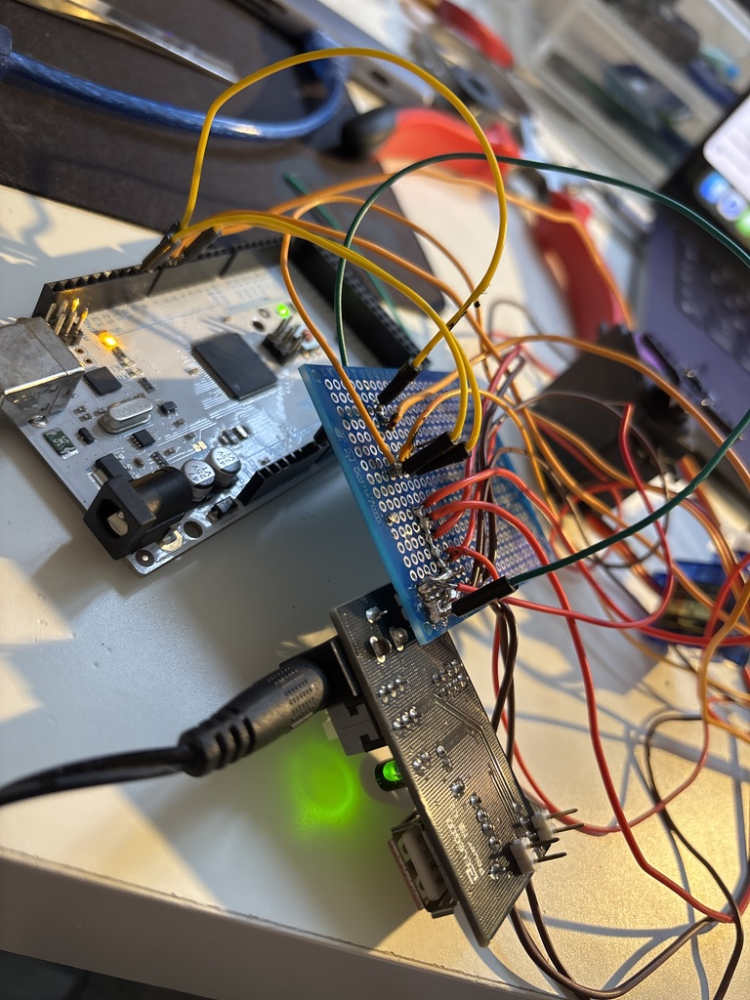
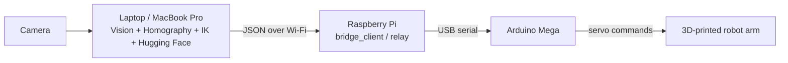
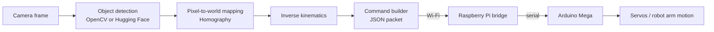

# Robotic Arm

4-DOF robotic arm project with:
- inverse kinematics
- PyBullet simulation
- object detection with classical OpenCV vision
- open-vocabulary detection with Hugging Face models
- French voice commands
- network communication to Raspberry Pi / Arduino
- reinforcement learning for grasping

This repository contains both modular building blocks and quick test scripts. The important point is that not everything is wired into one end-to-end pipeline yet, but each subsystem can be launched and validated independently.

## Media

Assembly / construction:


Wiring overview:



## Hardware Setup

The printed arm geometry is based on the 3D model published by HowToMechatronics

For this project, that source is used as the reference for the mechanical 3D model only. The software stack, networking, computer vision pipeline, and Raspberry Pi bridge used in this repository are custom to this project.

Reference mechanical model:
- 5-DOF printed arm
- MG996R servos for the first 3 axes: waist, shoulder, elbow
- SG90 micro servos for wrist roll, wrist pitch, and gripper
- original STL / 3D model source linked from the HowToMechatronics article

Actual hardware used in this project:
- 3D-printed robot arm based on that reference model
- Arduino Mega for low-level servo control
- Raspberry Pi connected to the Arduino Mega
- an always-on `bridge_client` / relay process on the Raspberry Pi
- laptop running vision, Hugging Face models, homography, and IK
- camera connected to the laptop for object detection

### Hardware topology



### Data flow



In this repository, the closest matching files for that stack are:
- `real_arm_controller.py` for the PC-side real-arm pipeline
- `pi_relay.py` for the Raspberry Pi ZMQ-to-serial relay
- `network.py` and `requete.py` for network command transport

## Overview

Main modules:
- `kinematics.py`: kinematic chain, IK, joint limits
- `simulation.py`: PyBullet digital twin of the arm and workspace
- `perception.py`: color/shape detection with OpenCV
- `vision.py`: camera capture and pixel-to-world homography
- `live_detection.py`: selective real-time OpenCV detection with trackbars
- `live_detection_hf.py`: open-vocabulary detection with Hugging Face
- `brain_controller.py`: orchestration for simulation, network, voice, and vision
- `voice_control.py`: Google Speech recognition, optimized for French
- `network.py`: command sending in simulated or ZeroMQ mode
- `IA.py`: reinforcement learning for grasping and lifting objects
- `calibrate.py`: PyBullet tool for pose and gripper calibration
- `requete.py`: simple ZeroMQ command sender to the robot

Useful local documentation:
- `VOICE_CONTROL_GUIDE.md`
- `ROBOT_ARCHITECTURE_EXPLAINED.md`

## Requirements

- Python 3.10+ recommended
- macOS / Linux / Windows
- Webcam if you want to test vision
- Microphone if you want to test voice control
- Apple Silicon supports `mps` for PyTorch inference

## Installation

Create a virtual environment:

```bash
python3 -m venv venv
source venv/bin/activate
python -m pip install --upgrade pip
```

Base install for simulation and classical vision:

```bash
pip install numpy opencv-python pybullet ikpy pyzmq pyserial SpeechRecognition gymnasium pillow
```

If you want to use Hugging Face object detection:

```bash
pip install torch torchvision torchaudio transformers pillow
```

If you want to use RL training:

```bash
pip install "stable-baselines3[extra]"
```

Notes:
- `pyaudio` may require extra system-level installation depending on your platform.
- On the first run of `live_detection_hf.py`, the model is downloaded from Hugging Face.

## Quick Start

### 1. Main demo

Run the main controller in demo mode:

```bash
python brain_controller.py
```

Interactive PyBullet mode:

```bash
python brain_controller.py --gui
```

Mode with camera initialized:

```bash
python brain_controller.py --camera
```

Important:
- `brain_controller.py --camera` initializes the camera, but it does not yet run a full live detection + robot action loop.
- To test live vision directly, use `live_detection.py` or `live_detection_hf.py`.

### 2. Classical OpenCV vision

Color/shape detection with filters and live trackbars:

```bash
python live_detection.py
```

This script is useful for:
- validating the webcam
- tuning selectivity
- reducing simple false positives

### 3. Hugging Face AI vision

Open-vocabulary detection for more complex objects, for example:
- pen
- notebook
- glue
- ruler
- eraser

Default launch:

```bash
python live_detection_hf.py
```

Example with explicit labels:

```bash
python live_detection_hf.py --labels "stylo, cahier, colle, regle, gomme, pen, notebook, glue stick, ruler, eraser"
```

Lighter example to reduce load:

```bash
python live_detection_hf.py --infer-width 640 --infer-height 360 --infer-fps 2 --target-fps 15
```

This script:
- uses `IDEA-Research/grounding-dino-tiny`
- tries `mps` automatically on Apple Silicon Macs
- displays render FPS and inference FPS
- lets you tune thresholds through trackbars

Practical limitation:
- open-vocabulary detection is much heavier than classical OpenCV detection
- the video stream can stay smooth while the number of detections per second remains low depending on model and resolution

### 4. Calibration and simulation

Manual calibration tool in PyBullet:

```bash
python calibrate.py
```

Test the perception module without a camera:

```bash
python perception.py
```

Test the vision / homography module:

```bash
python vision.py
```

### 5. Voice control

Voice mode in the main controller:

```bash
python brain_controller.py --voice
```

The voice module:
- listens in French
- uses a wake word such as `bonjour bras`
- detects intents like `pick`, `place`, `open`, `close`, `home`, `stop`

See also `VOICE_CONTROL_GUIDE.md`.

### 6. Network communication

The main controller supports several modes:
- `simulated`: prints commands only
- `zmq`: sends real commands through ZeroMQ
- `serial`: present in the architecture, to be verified against your real hardware setup

Examples:

```bash
python brain_controller.py --network simulated
python brain_controller.py --network zmq
```

Send a quick predefined command to a ZeroMQ endpoint:

```bash
python requete.py
python requete.py idle
python requete.py custom
```

Check the IP and port in `requete.py` and `network.py` before using it on real hardware.

### 7. AI / RL training

Start training:

```bash
python IA.py --train
```

Train longer:

```bash
python IA.py --train --steps 500000
```

Test a trained model:

```bash
python IA.py --test
```

Visualize the environment:

```bash
python IA.py --demo
```

Training auto-saves into `models/` and resumes if a compatible checkpoint already exists.

## Project Structure

```text
.
├── README.md
├── IA.py
├── brain_controller.py
├── calibrate.py
├── grasp_planner.py
├── kinematics.py
├── live_detection.py
├── live_detection_hf.py
├── network.py
├── perception.py
├── requete.py
├── simulation.py
├── vision.py
├── voice_control.py
├── arduino_arm.urdf
├── medias/
├── models/
├── logs/
└── additional docs (*.md)
```

## Current Project State

This repository is already useful for:
- testing kinematics and simulation
- prototyping classical and AI-based vision
- validating voice commands
- preparing a pick-and-place pipeline

Still, keep these limitations in mind:
- live camera detection is currently tested mainly through dedicated scripts
- Hugging Face detection is not yet automatically connected to a full grasping loop
- some network / hardware parts still depend on your physical setup

## Files Worth Reading Next

If you want to understand the project without opening everything in the IDE:
- `ROBOT_ARCHITECTURE_EXPLAINED.md` for the overall logic
- `VOICE_CONTROL_GUIDE.md` for the voice stack
- `simulation.py` for the digital twin
- `live_detection_hf.py` for the modern vision path

## Suggested Next Steps

Logical next improvements would be:
- add a proper `requirements.txt` or `pyproject.toml`
- connect live detection to `brain_controller.py`
- save camera calibration to a file
- add a pick-and-place mode driven by Hugging Face detections
