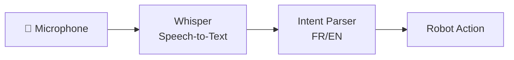

# 🎤 Guide de Commande Vocale - Robot Arm

## Comment ça fonctionne ?

Le système de commande vocale utilise **OpenAI Whisper** pour convertir ta voix en texte, puis **parse** le texte pour identifier l'intention (action + cible).



---

## Installation

```powershell
# Installer Whisper et dépendances audio
pip install openai-whisper pyaudio

# Sur Windows, vous devrez peut-être aussi installer:
# - ffmpeg (pour Whisper)
# - PortAudio (pour pyaudio)
```

> [!NOTE]
> **Premier lancement** : Whisper télécharge le modèle (~150MB pour "base") automatiquement.

---

## Commandes Supportées

| Français | English | Action |
|----------|---------|--------|
| "Prends le cube rouge" | "Pick the red cube" | Détecte + attrape |
| "Pose à gauche" | "Place on the left" | Déplace + relâche |
| "Montre-moi la balle" | "Show me the ball" | Pointe vers objet |
| "Ouvre la pince" | "Open gripper" | Ouvre pince |
| "Ferme la pince" | "Close gripper" | Ferme pince |
| "Stop" / "Arrête" | "Stop" | Arrêt urgence |
| "Maison" / "Home" | "Home" | Position repos |

---

## Utilisation

### Mode Interactif
```powershell
cd c:\Users\rusak\Desktop\ProjetX\robotic-arm
python brain_controller.py --voice
```

### Mode Test (sans micro)
```python
from voice_control import VoiceController

vc = VoiceController()

# Tester sans micro (texte simulé)
intent = vc.listen_command_simulated("prends le cube rouge")
result = vc.execute_voice_command(intent)
print(result)
# → {'success': True, 'action': 'pick', 'message': '🤏 Saisie de: red cube', ...}
```

---

## Architecture du Module

```
voice_control.py
├── VoiceController
│   ├── load_model()          # Charge Whisper
│   ├── transcribe(audio)     # Audio → Texte
│   ├── parse_intent(text)    # Texte → Intent
│   └── execute_voice_command()
│
├── VoiceIntent (dataclass)
│   ├── action: CommandAction
│   ├── target_object: str    # "cube", "sphere"
│   ├── target_color: str     # "red", "blue"
│   └── confidence: float
│
└── CommandAction (enum)
    ├── PICK, PLACE, MOVE
    ├── SHOW, OPEN, CLOSE
    └── STOP, HOME
```

---

## Dépannage

| Problème | Solution |
|----------|----------|
| "No speech detected" | Parle plus fort / plus près du micro |
| Whisper non installé | `pip install openai-whisper` |
| PyAudio erreur | Installer PortAudio: `pip install pipwin; pipwin install pyaudio` |
| Commande non reconnue | Utilise des mots-clés simples (prends, pose, stop) |
